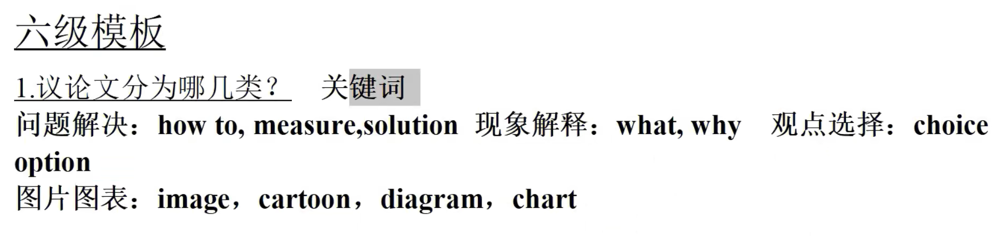

<!--
 * @Author: WangJC 781424275@qq.com
 * @Date: 2022-06-04 17:53:09
 * @LastEditors: WangJC 781424275@qq.com
 * @LastEditTime: 2022-06-11 13:00:46
 * @FilePath: \markdown\英语六级作文\作文.md
 * @Description: 这是默认设置,请设置`customMade`, 打开koroFileHeader查看配置 进行设置: https://github.com/OBKoro1/koro1FileHeader/wiki/%E9%85%8D%E7%BD%AE
-->

# 第一段

### 1 现象解释
In the contemporary world, _中心词 has/have become increasingly important.

It's of gerat important for _人 to _短语 .

Reasons and concreate evidence to support my view point are as follows.

### 2 问题解决
In the contemporary world, _中心词 has become increasingly important. 

It's of great necessary for _人 to _短语. 

The following solutions can account for this issue properly.

### 3 观点选择 
In the contemporary world, _中心词 has become increasingly important. 

When faced with the decesion of __, quite a few would deem that __,but others, in contrast, believe that __ is the premire choice and that is also my porint.

The following solutions can account for this issue properly.

### 4 谚语
As an old saying goes: __抄谚语句子. 

For us college students, it has an increasingly important significance: __解释含义句子. 

The following reasons can account for this issue.

### 5 图表
As is starkly reflected in the chart/image that__.

It is revealed that ___.

The following reasons can account for this issue.
# 第二段
##### 论点1
In the first place, there is no doubt (we can't divorce from the reality) that _名词 play/plays a crucial role in _名词.

##### 论据1
Based on big data, most _人 admitted that __句子.

##### 论点2
Moreover, no one can deny that __句子.

##### 论据2
Where there is/are __名词, there is/are __名词.

##### 论点3
Last but not least, I firmly believe that __句子.

##### 论据3 
The more _名词 you are, the more _名词 you will get.

### 第三段
In conclusion, __点题.

if we spare no effort to __短语, the future of our life will be both hopeful and rosy.
